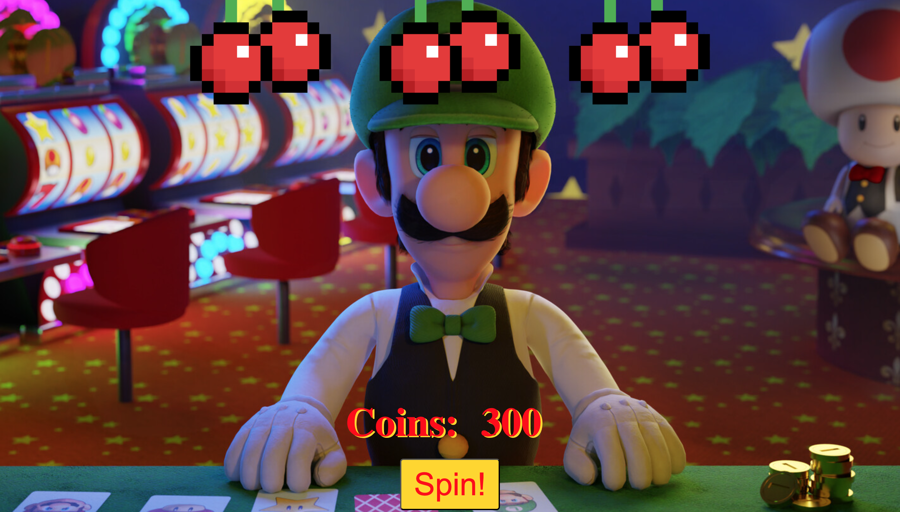

# 🎰 Slot Machine

### Step into Luigi's Casino and see how much you can win!



Spin the slot machine. You start off with 300 coins. If you spin two of you are rewarded 30 coins, if you spin three of a kind you are rewarded 75 coins, and if you spin no matching then you get no reward.

### Tech Used:

- HTML
- CSS
- Javascript

### Lessons Learned

  - Using Math script practice to help get the radomization to work.
  - The use of conditionals to help make the winning and losing functions work.
  - The use of DOM elements to tell people how many coins they got when they won or when they lost.

### Review:
```
I completed the challenge: 5
I feel good about my code: 4
Would love feedback. Maybe a way I can make a spin function for the slot machine.
```
